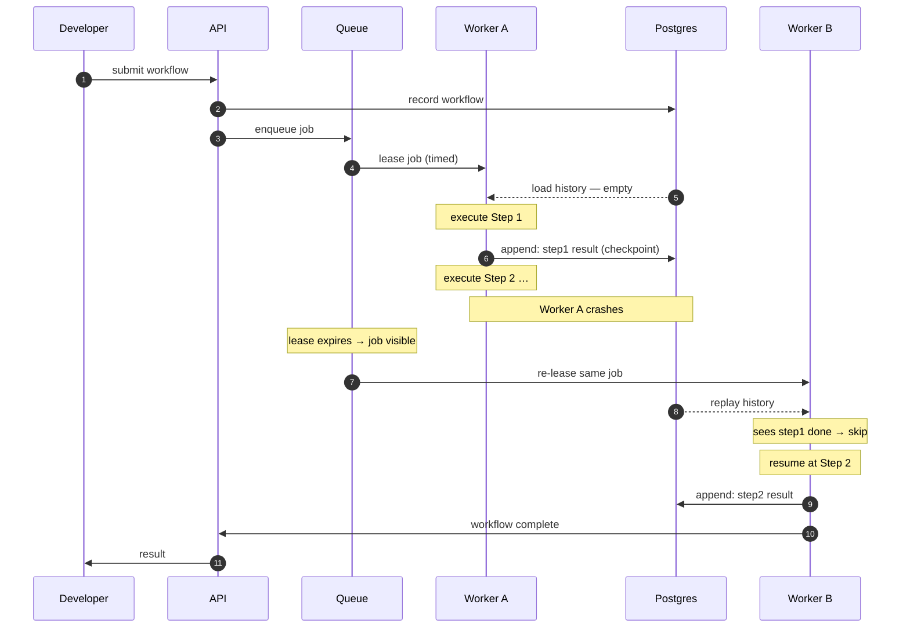

# Architecture

Replay is a platform for executing long-running AI agent workflows reliably. This
document describes the runtime's structure and its defining behaviour: crash survival by
event replay.

## Contents

- [Overview](#overview)
- [Core components](#core-components)
- [The central mechanism: crash survival by replay](#the-central-mechanism-crash-survival-by-replay)
- [Sequence: crash survival by event replay](#sequence-crash-survival-by-event-replay)
- [Why one mechanism, three behaviours](#why-one-mechanism-three-behaviours)
- [Why not a generic job runner?](#why-not-a-generic-job-runner)

## Overview

The runtime separates three concerns:

1. A **stateless API** for submission and streaming.
2. A **durable store of record** — the event log.
3. A pool of **interchangeable workers** that lease jobs and drive workflows forward by
   replaying and appending events.

The core mechanism is **event-sourced durable execution**: a workflow's progress is stored
as an append-only log of events in a database, and its live state is a deterministic
function of that log. A crashed workflow is resumed by a fresh worker that replays the log,
skips already-completed steps, and continues.

## Core components

| Component | Responsibility | Technology |
|-----------|----------------|------------|
| API | Job submission, status, log streaming (SSE), approvals | FastAPI |
| Event store | Append-only event log; workflow & step tables; store of record | PostgreSQL |
| Queue | Job dispatch with visibility-timeout leasing | Redis (local) / SQS (cloud) |
| Workers | Lease jobs, replay history, execute next step, append events | Python worker pool |
| Sandbox | Isolated per-step execution with limits & timeout | Docker |
| Artifact store | Large outputs and logs | S3 |
| Telemetry | Traces, metrics, dashboards | OpenTelemetry + Prometheus + Grafana |

## The central mechanism: crash survival by replay

This is the defining behaviour of the platform — the one flow a reader should understand
fully.

1. A developer submits a workflow; the API records it and enqueues a job.
2. A worker leases the job (acquiring a time-limited lease) and loads the event history —
   initially empty.
3. The worker executes Step 1. Before a tool call it appends an **intent** event; after
   success it appends a **result** event (the checkpoint).
4. The worker crashes while executing Step 2. Its lease is not renewed.
5. The lease expires. The queue makes the job visible again.
6. A different worker leases the same job and replays the history. It sees Step 1's result
   event, so it **skips re-executing Step 1** — no duplicated side effect — and resumes at
   Step 2.
7. The workflow runs to completion as if the crash never happened.

## Sequence: crash survival by event replay

## Why one mechanism, three behaviours

Because completed steps are recorded **before** the next step begins:

- **Retries never duplicate side effects** — a replaying worker skips any step already
  present in the log.
- **Crash recovery is automatic** — an expired lease returns the job; replay restores state.
- **Pause-for-approval is just an event** — a "waiting for approval" event withholds the job
  from scheduling until an approval event is appended.

One mechanism; three behaviours. The rest of the design falls out of it.

## Why not a generic job runner?

Traditional job runners assume tasks that are short, stateless, and safe to retry wholesale.
AI agent workloads violate all three assumptions.

| Traditional job | AI agent workflow |
|------------------|-------------------|
| Seconds to a minute | Minutes to hours |
| Stateless; retry from scratch is fine | Stateful; retry must resume, not restart |
| One unit of work | Many steps: LLM calls, tool calls, sub-agents |
| No human in the loop | May pause for approval before a risky action |
| Idempotent or side-effect-free | Real side effects (emails, payments, writes) |
| Output is a value | Output is a stream, plus token usage and cost |

A generic runner that retries a half-finished 40-minute workflow from the beginning would
re-send emails, re-charge cards, and re-burn tokens. Replay's event-sourced model exists
precisely to make **resume, not restart**, the default.

## Design principles

1. **Deterministic** — a workflow's state must always be reconstructable by replaying its persisted events.
2. **Durable** — a worker crash must never lose completed work.
3. **Observable** — every significant action leaves an inspectable trace with timing, tokens, and cost.
4. **Isolated** — one workflow can never interfere with another.
5. **Minimal** — prefer one mechanism that produces many behaviours over many special-cased features.
